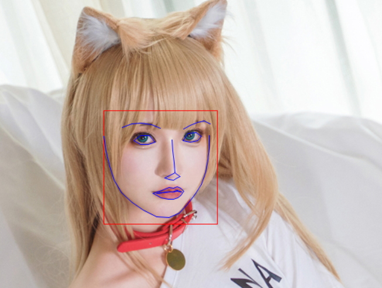
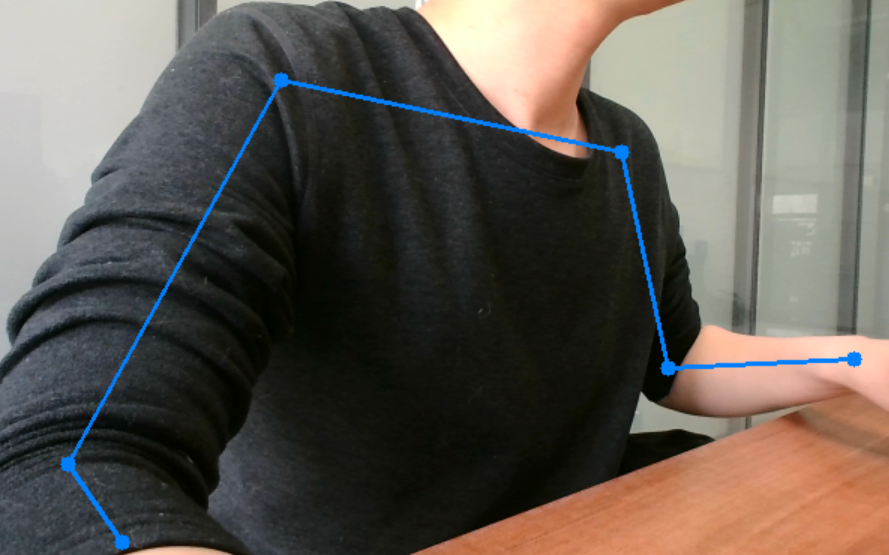

# [PythonExample](https://github.com/WindSnowLi/My-python-tools)

关于pyhon的小例子
___

## 1. [PseudoOperation](https://github.com/WindSnowLi/My-python-tools/tree/main/PseudoOperation)

通过简单的记录鼠标坐标，并通过计算鼠标下图片的偏移来完成简单的位置校准，用于在微偏移的界面模拟鼠标操作

1. [记录部分](https://github.com/WindSnowLi/My-python-tools/blob/main/PseudoOperation/main/record_process.py)
2. [操作部分](https://github.com/WindSnowLi/My-python-tools/blob/main/PseudoOperation/main/operate_process.py)

___

## 2. [DownloadM3u8](https://github.com/WindSnowLi/My-python-tools/blob/main/DownloadM3u8)

1. [下载网站的m3u8视频](https://github.com/WindSnowLi/My-python-tools/blob/main/DownloadM3u8/dv.py)
2. [合并成完整视频文件](https://github.com/WindSnowLi/My-python-tools/blob/main/DownloadM3u8/marge.py)

___

## 3. [PythonGetCookie](https://github.com/WindSnowLi/My-python-tools/tree/main/PythonGetCookie)

### 3.1 仅通过python3网络库获取请求cookie

```python
def get_cookie(url)
```

### 3.2 通过浏览器获取cookie(firefox与chrome类似)

```python
def firefox_get_cookies(url)
```

___

## 4. [VerifyIP]((https://github.com/WindSnowLi/My-python-tools/tree/main/VerifyIP))

备份并更新系统hosts文件中的IP信息

1. ```# MY_MUST_START``` 需要更新的开始标识
2. ```# MY_MUST_END``` 需要更新的结束标识

___

## 5. [QR-Code](https://github.com/WindSnowLi/My-python-tools/tree/main/QR-Code)

1. 二维识别码
2. 二维码创建

————

## 6. [Read-MNIST](https://github.com/WindSnowLi/My-python-tools/tree/main/Read-MNIST)

1. 需自行解压数据集至.py文件同级目录

___

## 7. [Windows11Reg](https://github.com/WindSnowLi/My-python-tools/tree/main/Windows11Reg)

1. Windows11开始菜单与Windows10开始菜单转换（新版已失效）
2. *需重启电脑*

### 依赖

1. pip install pywin32
___

## 8. [send_mail](https://github.com/WindSnowLi/My-python-tools/tree/main/send_mail)

1. python3发送邮件

---

## 9. [ResizeImg](https://github.com/WindSnowLi/My-python-tools/tree/main/ResizeImg)

1. 使用`opencv-python`的`resize`函数
2. Linux使用`pip3 install opencv-python`、Windows使用`pip install opencv-python`安装`opencv-python`
3. 用于重设图片大小，主要用来遇到图片大小限制时缩放图片

---

## 10. [Img->ico](https://github.com/WindSnowLi/My-python-tools/tree/main/Img-_ico)

1. Python3修改图片格式为ico
2. *有时会遇到将图片修改为ico格式，但是轻量级的工具不好找，在这里借用pillow库达到了这个效果*

---

## 11. [Img->Str](https://github.com/WindSnowLi/My-python-tools/tree/main/Img-_Str)

1. 简笔画图片转字符串
2. 示例图片


3. 结果


---

## 12. [CheckID](https://github.com/WindSnowLi/My-python-tools/tree/main/CheckID)

1. 校验身份证号是否合法

---

## 13. [shard_download](https://github.com/WindSnowLi/My-python-tools/tree/main/shard_download)

1. 分片多进程下载文件
---

## 14. [file_md5](https://github.com/WindSnowLi/My-python-tools/tree/main/file_md5)

1. 计算文件的MD5
---

## 15. [生成UUID](https://github.com/WindSnowLi/My-python-tools/tree/main/uuid)

---

## 16. [文件批量MD5命名](https://github.com/WindSnowLi/My-python-tools/tree/main/renane_files_md5)

1. 批量将文件重命名为自身MD5，可用于合并文件夹文件内容时文件冲突覆盖

---

## 17. [过滤库文件](https://github.com/WindSnowLi/My-python-tools/tree/main/r_d_libs)

1. 筛选文件夹中的d.lib、.lib、d.dll、.dll文件

---

## 18. [获取文本文件编码](https://github.com/WindSnowLi/My-python-tools/tree/main/get_encoding)

1. 获取文本文件编码

---

## 19. [导出源代码](https://github.com/WindSnowLi/My-python-tools/tree/main/export_source)

1. 导出源代码

---

## 20. [使用dlib预训练模型检测人脸和关键点](https://github.com/WindSnowLi/My-python-tools/tree/main/dlib-face)

1. 使用dlib检测人脸和关键点

2. 结果




---

## 21. [MP4转gif](https://github.com/WindSnowLi/My-python-tools/tree/main/mp4-gif)

1. MP4转gif
---

---

## 22. [Yolov7人体关键点检测](https://github.com/WindSnowLi/My-python-tools/tree/main/yolov7-pose-estimation)

1. yolov7-pose-estimation

2. [yolov7-w6-pose.pt下载地址](https://github.com/WongKinYiu/yolov7/releases/download/v0.1/yolov7-w6-pose.pt) 


---
